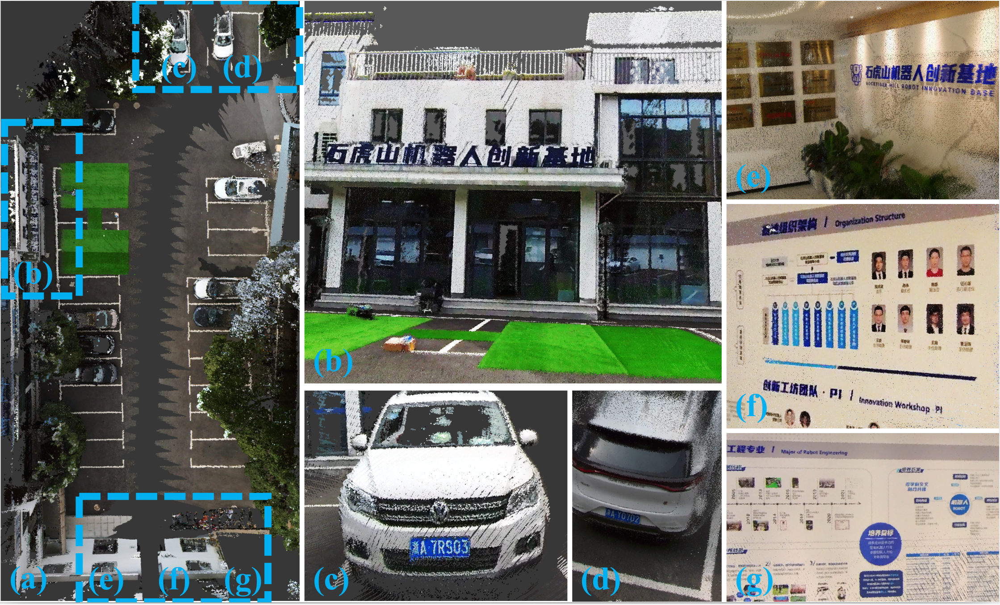
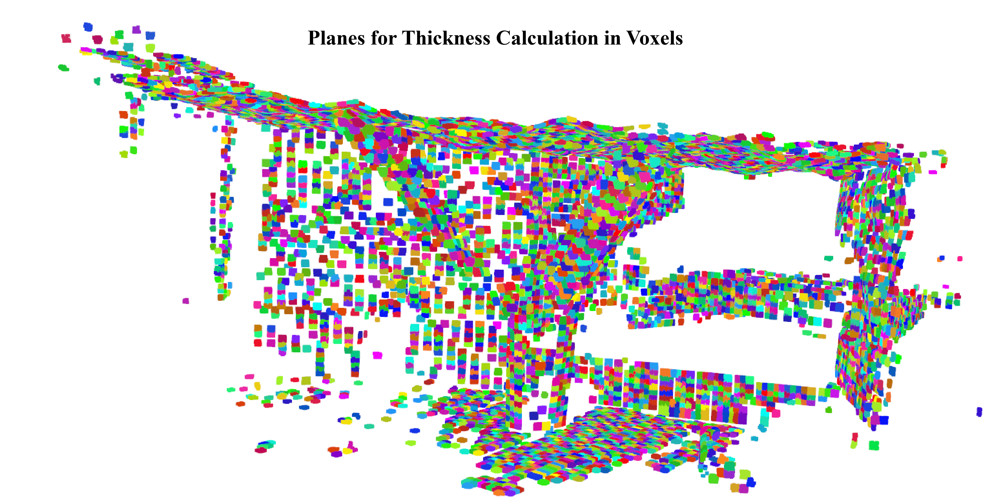
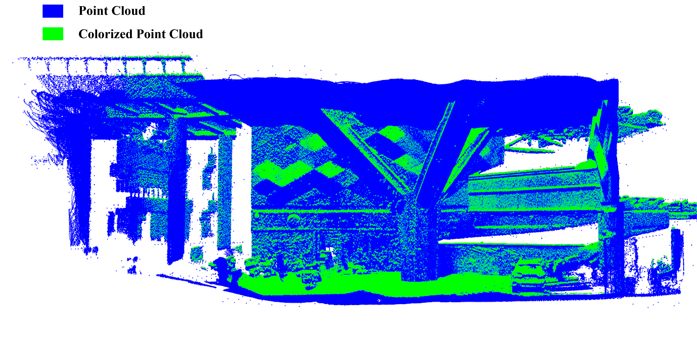
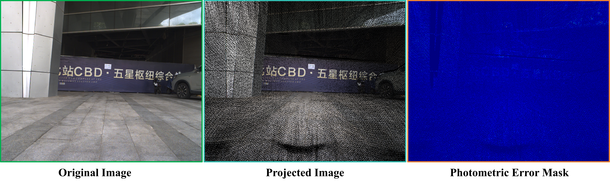
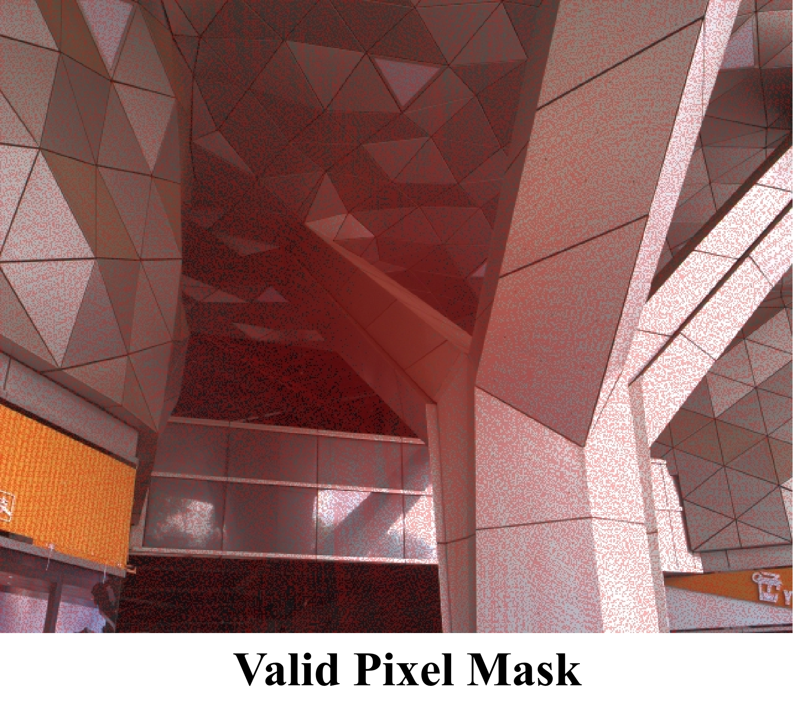

# RISED: Accurate and Efficient RGB-Colorized Mapping Using Image Selection and Point Cloud Densification

<div align="center">
<a href="https://ieeexplore.ieee.org/abstract/document/11127540"></a>
<a href="https://www.youtube.com/watch?v=hekSMeu1ihg"></a>
</div>

<div align="center">

</div>


## 🛠 Getting Started

### Prepare your data
Here we test this evaluation tool using dataset from [Global-LVBA](https://github.com/xuankuzcr/Global-LVBA/tree/master), you can download the data from [link](https://pan.baidu.com/s/1SxTVGmDzJHnHL3muk-10eg?pwd=6666#list/path=%2F).

For the evaluation of **geometric accuracy** and **surface coverage**, preparing the global point cloud map and colorized point cloud map is sufficient. However, if you want to evaluate the **projection accuracy**, you're encouraged to prepare the initial datas of images and pcds bellow:

```
    RISED/
    └── data/
        └── sequence_name/
                ├── all_image/
                │   ├── 1661398632.022152.png     # image named by timestamp
                │   ├── 1661398632.121881.png
                │   ├── ...
                │   └── image_poses.txt           # camera poses (timestamp-aligned)
                ├── all_pcd_body/
                    ├── 1661398632.022152.pcd     # point cloud named by timestamp in body frame
                    ├── 1661398632.121881.pcd
                    ├── ...
                    └── lidar_poses.txt           # LiDAR poses (timestamp-aligned)
```


### Intallation

Use conda to manage your Python environment:
```
conda create -n rised python=3.10 -y
conda activate rised
pip install -r requirements.txt
```

## 💡 Evaluation
Change the parameters in config/config.yaml.

To project and generate the global colorized map, you can run:
```
python3 utils/projection.py
```

For the three evaluation metrics and relevant visulization, you can run them seperately:
```
#  Projection accuracy
python3 example/evaluate_projection.py

# Geometric accuracy
python3 example/evaluate_geometry.py

# Surface coverage
python3 example/evaluate_projection.py
```
To evaluate all above three metrics in one manner and get the results precisely, run:
```
python3 main.py
```

## 📊 Visualization

### Geometry Accuracy

<div align="center">

</div>

### Surface Coverage

<div align="center">

</div>

### Projection Accuracy

**Photometric Error:**

<div align="center">

</div>

**Valid Pixel Ratio:**
<div align="center">

</div>

## 🤗 Citation
If you find this repository useful, please use the following BibTeX entry for citation.
```
@inproceedings{rised,
  title={RISED: Accurate and Efficient RGB-Colorized Mapping Using Image Selection and Point Cloud Densification},
  author={Jiang, Changjian and Wang, Lijie and Wan, Zeyu and Gao, Ruilan and Wang, Yue and Xiong, Rong and Zhang, Yu},
  booktitle={2025 IEEE International Conference on Robotics and Automation (ICRA)},
  pages={3277--3283},
  year={2025},
  organization={IEEE}
}
```

## 👏 Acknowledgements

This repo benifits from [Global-LVBA](https://github.com/xuankuzcr/Global-LVBA/tree/master), [LiDAR-VGGT](https://github.com/NorwegianSmokedSalmon/Color-Map-Evaluation).